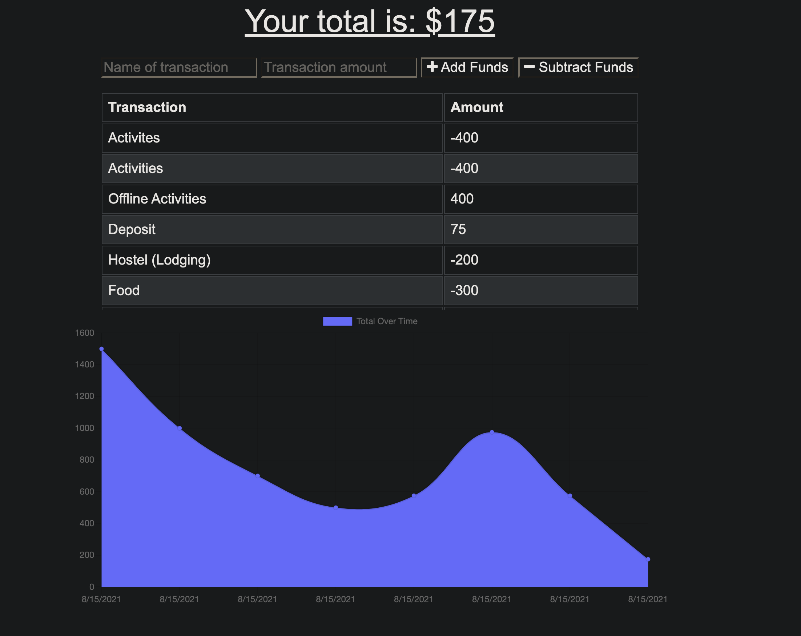

# Budget Tracker

## Purpose
The purpose of this application is to show my knowledge on turning an already existing application in a PWA ( Progessive Web Application ). 

## Goals for the Project ( User Story )

AS AN avid traveler

I WANT to be able to track my withdrawals and deposits with or without a data/internet connection
SO THAT my account balance is accurate when I am traveling

## The Acceptance Criteria

GIVEN a budget tracker without an internet connection

WHEN the user inputs an expense or deposit
THEN they will receive a notification that they have added an expense or deposit

WHEN the user reestablishes an internet connection
THEN the deposits or expenses added while they were offline are added to their transaction history and their totals are updated

## Working App

## Technology Used
- MongoDB Atlas
- Mongoose
- Express

## Contributors
- Tyler Evans